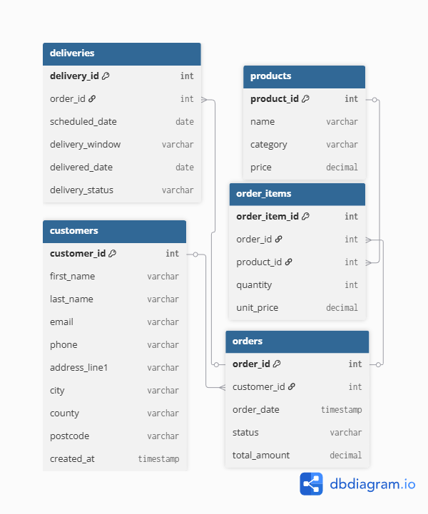

# Leedsburies Supermarket

## Context

In this exercise, you will explore and analyse a database for a UK supermarket. The database contains **products, customers, orders, order items, and deliveries**.

Your task is to answer questions about **orders, customer behaviour, product popularity, and delivery performance** using SQL to query the database and Python (pandas, matplotlib) to aggregate and visualise your findings. There are a range of different tasks, scaled from quite simple to much more complex.

We recommend you approach this in pairs - and don't expect to finish every task!

Remember that you can **use SQL files** to test queries before using them in Python.

---

## Database Diagram



---

## Instructions

1. Connect to the SQLite database using Python:  
   ```python
   import sqlite3
   import pandas as pd

   conn = sqlite3.connect("delivery_demo_light.db")
   ```
2. Use SQL queries via `conn.execute()` to fetch data.
3. Visualise results using **pandas or matplotlib** where needed.
4. You should build a set of **functions** so that you have a record of each task.

---
## Data Visualisation

For plots, you can gather query results to a **pandas DataFrame** using pandas built-in query function:  
  ```python
  df = pd.read_sql_query("SELECT ...", conn)
  df.plot.bar(x="category", y="total_revenue")
  ```

This saves you needing to then convert the tuples for use with matplotlib or the visualisation library of your choice.

---

## Tasks

### Level 1 – Warm-up

1. List all **product categories** in the database.  
2. Count the **total number of customers**.  
3. Show all **orders for a given customer** (ask for a specific email).  
4. Display **all products priced below £2**.  

---

### Level 2 – Basic Analytics

5. Compute **total spent per customer**. Display the top 5 spenders.  
6. Count **orders per product category** and show these in descending order. Challenge: Plot a bar chart to show this.
7. Calculate **average number of products per order**.
8. Summarize **deliveries by status** (`scheduled`, `delivered`, `failed`) and plot a pie chart.  

---

### Level 3 – Intermediate / Advanced

9. List the **top 10 most popular products** by quantity sold.  
10. Compute **total revenue per category** and visualize as a bar chart or pie chart.  
11. Count **orders per delivery time window** and visualize busiest slots.  
12. Identify **top customers by average order value**.  
13. Compute **delivery performance by time window**: number of delivered vs failed orders per slot.

---

### Level 4 – Stretch / Challenge (Optional)

14. Find **customers with more than one order** and compute repeat purchase rate.  
15. Determine **category co-occurrence**: which product categories are frequently ordered together? Visualise as a heatmap.  
16. Identify **delivery performance by customer**: proportion of delivered vs failed orders per customer.  
17. Forecast **expected revenue for the next 7 days** based on the past month’s orders.

---

## Level 5 – Big Stretch! Analysis Dashboard

**Objective:**  

Create a **mini interactive dashboard** that summarises key insights from the supermarket delivery database. The dashboard should help **analyse orders, revenue, customer behaviour, and delivery performance**. You will be able to re-use some of your work from earlier sections.

You will need to combine multiple tables, Python data analysis, and visualisation — similar to a real-world data analyst workflow.

This should have some sort of basic command-line UI to allow people to select what they want to see.

You can pick what you want to show - for example, you might have an in-depth customer view where you analyse a specific customer's trends. Think about what a real supermarket might want to know!

---

### Guidelines

1. Select your tools:  
   - Python libraries such as `pandas`, `matplotlib`, `seaborn`, `plotly`, or `streamlit`.
   - SQL queries to fetch and aggregate data.  

2. Suggested dashboard sections:

| Section | Suggested Content |
|---------|-----------------|
| **Orders Overview** | Total orders, orders per category, average basket size |
| **Revenue Analysis** | Revenue per product category, top 10 products by revenue |
| **Customer Insights** | Top 5 customers by total spend, repeat purchase rates |
| **Delivery Performance** | Orders per delivery window, delivered vs failed orders |
| **Optional Visualisations** | Co-occurrence of product categories, busiest delivery days |

3. You should include:
   - A Python script or Jupyter notebook implementing the dashboard.  
   - Clear labelling of plots and tables.  